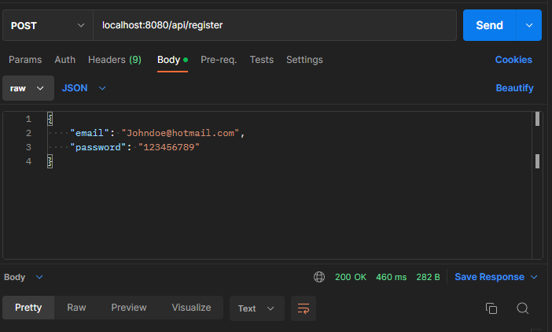
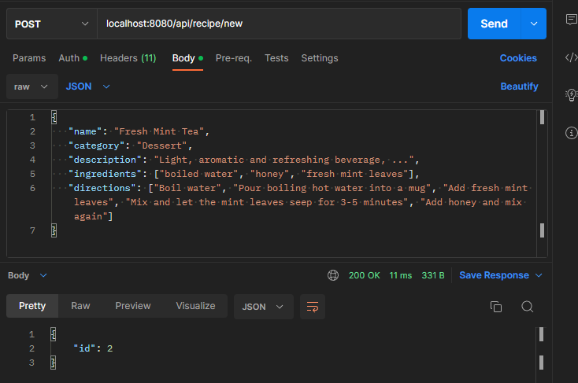
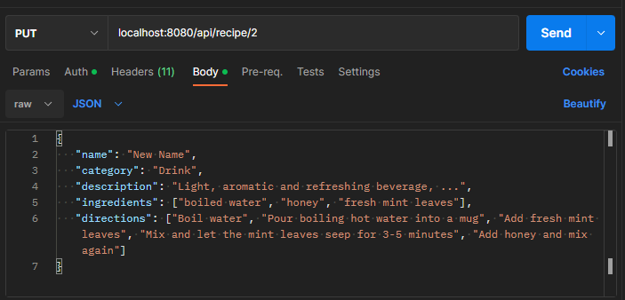
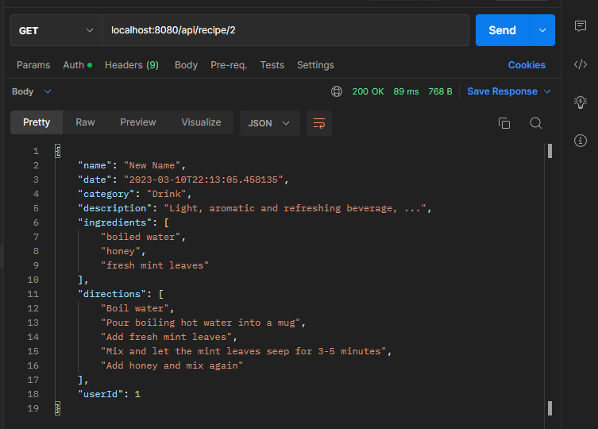
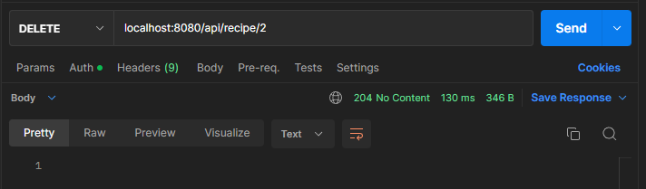
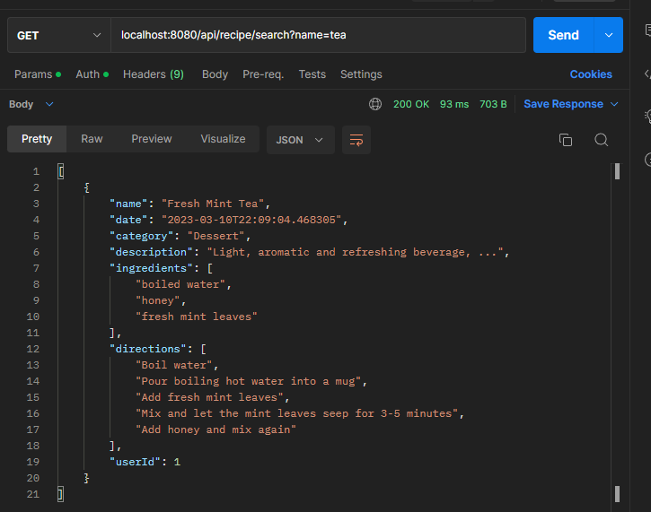
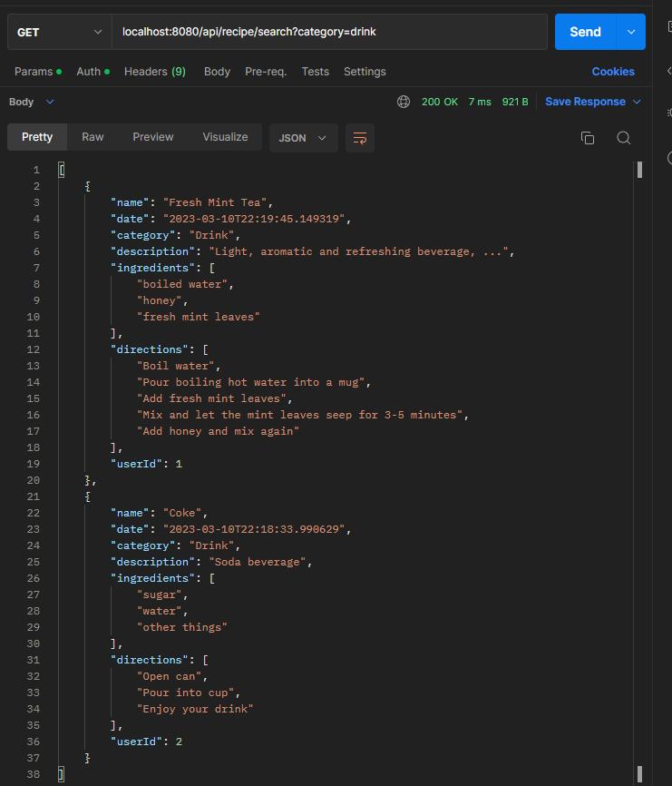

# Recipes REST API Service
Recipes service REST API For saving and reading recipes. You will be able to register an account, log on to that account and retrieves all the recipes you have created! You will be able to share, view, brows and handle recipes for all users using the REST API.

Built with Java Spring boot, and uses Spring boot Security.

The API can be combined with web building services HTML, JavaScript, React etc... to build a rich user experience webpages, or any other application that relies on Java Spring boot back-end application.

Database is created the first time app is started, and is used to store all the data, from user database to recipe database.
Users will be required to be registered before they can see, search, add or edit recipes on the web server.

The password will be saved in the databased hashed and secured.

# Requirement
- Java version 17+ <a href="https://www.oracle.com/de/java/technologies/downloads/">Java download Link</a>

# Build - Run Project
- Clone repository and navigate into repo's directory
- Run project with `$ ./gradlew bootRun`
- Server will be running on port `https://localhost:8080/` as the default port

# Stopping the server
To shut down the server use actuator by sending POST request to `https://localhost:8080/actuator/shutdown`

# Endpoints
Default port is `localhost:8080` Endpoints will be relative path to the local port.

- POST `api/register` will take a json of user register body with properties of email and password.

The other endpoints requires to be logged on
- POST `api/recipe/new` accepts json body as recipe, require to be logged in as valid user responds with recipe id object more information the examples bellow.
- GET `api/recipe/{id}` takes recipe id as path variable and return recipe object
- PUT `api/recipe/{id}` take recipe id as path variable and json recipe body, to edit and change the recipe
- DELETE `api/recipe/{id}` take recipe id as path variable and deletes the recipe from server database
- GET `apip/recipe/search?{name or catagory}` takes parameters such as `name=tea` or `catagory=desert` to query the database for recipes

Note: can only update and edit owned recipe posted by the same user, other users can only see other people recipes but not modify them.

HTTP requests are made using <a href="https://www.postman.com/">Postman</a>
# Example - Registering

Following examples required to be logged in after creating the account.

# Example - Posting Recipe

# Example - Editing Recipe

# Example - Getting Recipe

# Example - Deleting Recipe

# Example - Searching Recipe
- Using Name

 
- Using Category

